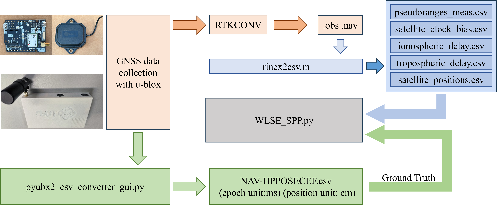
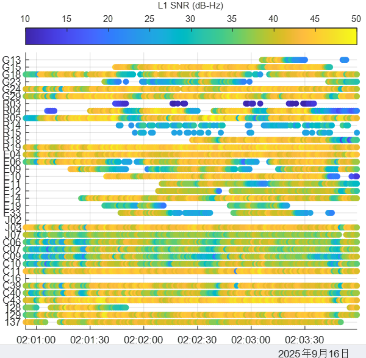
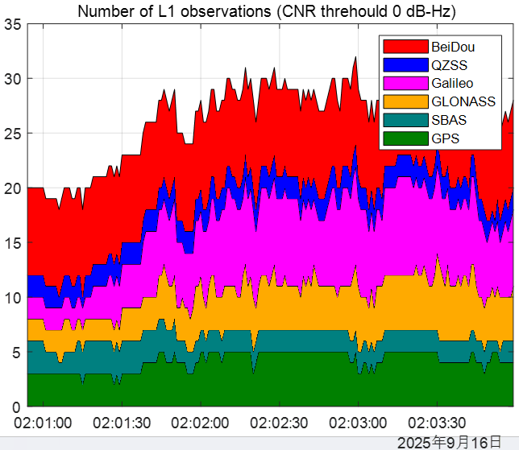
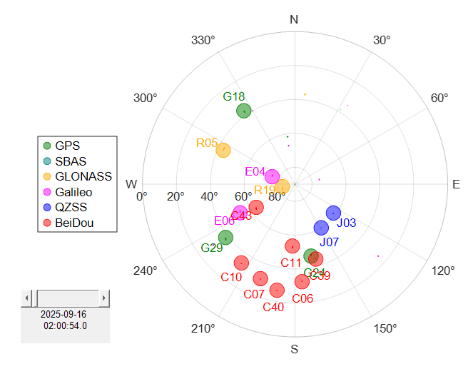
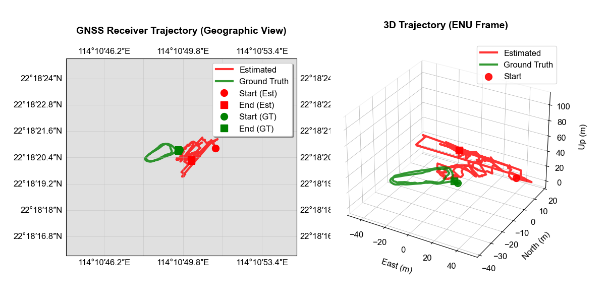
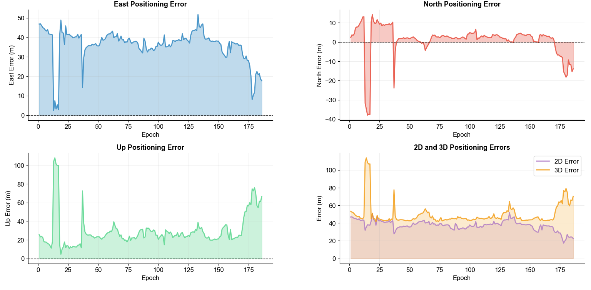
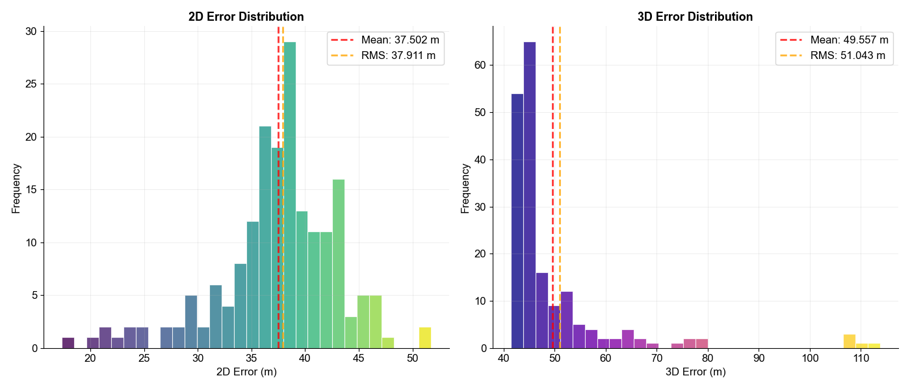
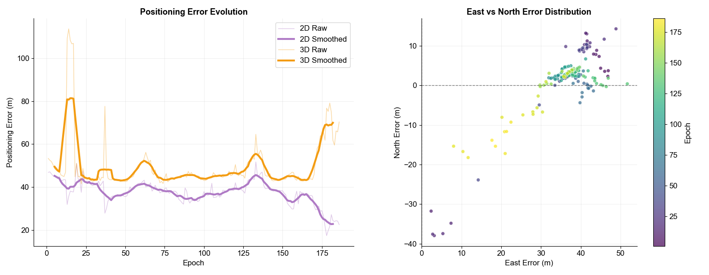

# GNSS Single Point Positioning (SPP) Analysis Pipeline

A comprehensive toolkit for processing GNSS UBX data files and performing Single Point Positioning (SPP) analysis with weighted least squares estimation.

## Overview

This pipeline provides a complete workflow for GNSS data processing, from raw UBX file conversion to advanced positioning analysis with error evaluation. The workflow includes data conversion, visualization, and statistical analysis of positioning accuracy.

## Table of Contents

1. [Prerequisites](#prerequisites)
2. [Installation](#installation)
3. [Workflow Overview](#workflow-overview)
4. [Step 1: UBX to RINEX Conversion](#step-1-ubx-to-rinex-conversion)
5. [Step 2: RINEX Data Processing](#step-2-rinex-data-processing)
6. [Step 3: UBX to CSV Conversion](#step-3-ubx-to-csv-conversion)
7. [Step 4: SPP Analysis](#step-4-spp-analysis)
8. [Results and Visualization](#results-and-visualization)
9. [Output Files](#output-files)
10. [Troubleshooting](#troubleshooting)

## Prerequisites

### Software Requirements
- **u-center** for data collection
- **MATLAB** with the following toolboxes:
  - Mapping Toolbox
  - Navigation Toolbox (recommended)
- **Python 3.7+** with the following packages:
  - numpy
  - matplotlib
  - pandas
  - pyubx2
  - cartopy (optional, for enhanced map visualization)
- **RTKLIB 2.5** (RTKconv and RTKPOST utilities)
- **Google Earth** for visualization
  
### Hardware Requirements

- Minimum 4GB RAM
- 1GB free disk space for data processing

## Installation

### 1. Clone the Repository

```bash
git clone https://github.com/weisongwen/AAE4203-S12526.git
cd AAE4203-S12526.git/Lab1
```

### 2. Install Python Dependencies

```bash
pip install numpy matplotlib pandas pyubx2 cartopy
```

**Note**: If you encounter issues with `cartopy`, you can install it using conda:
```bash
conda install -c conda-forge cartopy
```

For systems without cartopy, the code will automatically use fallback plotting methods.

### 3. Install MATLAB Dependencies

Ensure you have MATLAB installed with the matRTKLIB toolbox. Add the matRTKLIB directory to your MATLAB path.

### 4. Install RTKLIB

Download and install [RTKLIB_EX_2.5.0.zip](https://github.com/rtklibexplorer/RTKLIB/releases/download/v2.5.0/RTKLIB_EX_2.5.0.zip) from the official repository. Ensure `RTKCONV` and `RTKPOST` utilities are accessible from your system PATH.

## Workflow Overview

The complete pipeline consists of four main steps:



## Step 1: UBX to RINEX Conversion

### 1.1 Using rtkconv

1. Launch RTKconv from RTKLIB
2. Load your UBX file as input
3. Configure output settings:
   - Format: RINEX
   - Generate both observation (.obs) and navigation (.nav) files
4. Run conversion to generate RINEX files

### 1.2 Generate Reference Solution

1. Launch RTKPOST from RTKLIB
2. Load the generated RINEX observation and navigation files
3. Configure positioning mode (typically SPP for reference)
4. Generate reference positioning solution for accuracy comparison

## Step 2: RINEX Data Processing

### 2.1 Configure MATLAB Script

Open `rinex2csv.m` in MATLAB and update the file paths:

```matlab
% Change the obs and nav files to yours
obs = gt.Gobs(fullfile('COM6___9600_250916_020025_blockz.obs'));
nav = gt.Gnav(fullfile('COM6___9600_250916_020025_blockz.nav'));
```
```matlab
% Update these paths to match your data location
obs = gt.Gobs(fullfile('path/to/your/***.obs'));
nav = gt.Gnav(fullfile('path/to/your/***.nav'));
```

### 2.2 Run MATLAB Processing

Execute the script in MATLAB:

```matlab
run('rinex2csv.m')
```

### 2.3 Expected Outputs and Visualizations

The script will generate several visualizations and CSV files. Below are the examples:

#### Signal Quality Analysis

*SNR threshold analysis showing signal quality distribution*

#### Satellite Observation Count

*L1 observation count over time*

#### Sky Plot

*Satellite visibility and elevation angles*

#### SPP Results

*Single Point Positioning results from MATLAB processing*

### 2.4 Generated CSV Files

The following CSV files will be created for subsequent processing:
- `pseudoranges_meas.csv` - Raw pseudorange measurements
- `satellite_clock_bias.csv` - Satellite clock corrections
- `ionospheric_delay.csv` - Ionospheric delay corrections
- `tropospheric_delay.csv` - Tropospheric delay corrections
- `satellite_positions.csv` - Computed satellite positions

## Step 3: UBX to CSV Conversion

### 3.1 Install Dependencies

Ensure pyubx2 is installed:

```bash
pip install pyubx2
```

### 3.2 Run GUI Converter

Execute the Python GUI converter:

```bash
python pyubx2_csv_converter_gui.py
```

### 3.3 Using the GUI

1. **Select Input UBX File**: Browse and select your raw UBX data file
2. **Choose Output Directory**: Select where to save the converted CSV files
3. **Start Conversion**: Click "Start" to begin the conversion process

The GUI provides:
- Real-time progress indication
- Background processing to keep UI responsive
- Error handling and status updates

### 3.4 Key Output: Ground Truth Data

The conversion generates `NAV-HPPOSECEF.csv`, which contains high-precision positioning data that serves as ground truth for accuracy assessment.

## Step 4: SPP Analysis

### 4.1 Configure Python Script

Open `WLSE_spp.py` and verify the CSV file paths match your generated files:

```python
# Verify these file paths
satellite_positions = np.loadtxt('satellite_positions.csv', delimiter=',')
pseudoranges_meas = np.loadtxt('pseudoranges_meas.csv', delimiter=',')
satellite_clock_bias = np.loadtxt('satellite_clock_bias.csv', delimiter=',')
ionospheric_delay = np.loadtxt('ionospheric_delay.csv', delimiter=',')
tropospheric_delay = np.loadtxt('tropospheric_delay.csv', delimiter=',')
ground_truth = np.genfromtxt('NAV-HPPOSECEF.csv', delimiter=',', skip_header=1, usecols=[2,3,4,5])
```

### 4.2 Run SPP Analysis

Execute the weighted least squares SPP analysis:

```bash
python WLSE_spp.py
```

### 4.3 Algorithm Features

The SPP implementation includes:
- **Weighted Least Squares**: Elevation-angle dependent weighting
- **Multi-iteration Convergence**: Iterative position refinement
- **Comprehensive Error Correction**: Ionospheric, tropospheric, and clock corrections
- **Robust Filtering**: Low elevation and poor signal quality masking

## Results and Visualization

### Geographic and 3D Trajectory Analysis

*Left: Geographic trajectory with map overlay; Right: 3D ENU trajectory visualization*

### Positioning Error Analysis

*Time series analysis of East, North, Up, 2D, and 3D positioning errors*

### Statistical Error Distribution

*Histogram analysis showing 2D and 3D error distributions with statistical metrics*

### Error Correlation Analysis

*Left: Error evolution over time with smoothed trends; Right: East vs North error correlation*

## Output Files

### Primary Results
- `estimated_positions.csv`: Complete positioning solution with ECEF, LLA, and ENU coordinates
- `positioning_errors.csv`: Detailed error analysis for each epoch

### Generated Visualizations
- Geographic trajectory plots with cartographic features
- 3D trajectory visualization in ENU frame
- Comprehensive error analysis plots
- Statistical distribution analysis

### CSV File Structure

#### estimated_positions.csv
| Column | Description |
|--------|-------------|
| Epoch | Time epoch number |
| Latitude_deg | Latitude in decimal degrees |
| Longitude_deg | Longitude in decimal degrees |
| Altitude_m | Altitude in meters |
| Clock_Bias_m | Receiver clock bias in meters |
| East_m, North_m, Up_m | ENU coordinates |
| ECEF_X_m, ECEF_Y_m, ECEF_Z_m | ECEF coordinates |

#### positioning_errors.csv
| Column | Description |
|--------|-------------|
| Epoch | Time epoch number |
| Error_East_m | East positioning error |
| Error_North_m | North positioning error |
| Error_Up_m | Up positioning error |
| Error_2D_m | 2D horizontal error |
| Error_3D_m | 3D total error |

## Troubleshooting

### Common Issues

#### MATLAB Issues
- **matRTKLIB not found**: Ensure the matRTKLIB directory is added to MATLAB path
- **File path errors**: Use absolute paths or ensure files are in MATLAB working directory
- **Memory issues**: For large datasets, consider processing in smaller segments

#### Python Issues
- **pyubx2 import error**: Install using `pip install pyubx2`
- **cartopy installation issues**: Use conda installation or rely on fallback plotting
- **CSV file not found**: Verify file paths and ensure Step 2 completed successfully

#### Data Quality Issues
- **Insufficient satellites**: Check SNR thresholds and elevation angle masks
- **Poor positioning accuracy**: Verify correction models and satellite geometry
- **Conversion failures**: Ensure UBX files are valid and not corrupted

### Performance Optimization

#### For Large Datasets
- Process data in segments if memory becomes an issue
- Adjust visualization parameters for better performance
- Consider using more restrictive satellite selection criteria

#### Accuracy Improvements
- Adjust SNR and elevation angle thresholds
- Fine-tune weighting functions
- Consider additional error correction models

## Technical Notes

### Coordinate Systems
- **ECEF**: Earth-Centered, Earth-Fixed coordinates
- **LLA**: Latitude, Longitude, Altitude
- **ENU**: East, North, Up local coordinate system

### Error Correction Models
- Ionospheric delay correction using broadcast parameters
- Tropospheric delay using standard atmospheric models
- Satellite clock corrections from navigation message
- Elevation-angle dependent weighting for measurement quality

### Algorithm Convergence
- Maximum 100 iterations per epoch
- Convergence threshold: 1e-4 meters
- Automatic fallback to unweighted least squares if needed

## Contributing

Contributions are welcome! Please ensure:
- Code follows existing style conventions
- New features include appropriate documentation
- Test with various datasets before submission

## License

This project is licensed under the MIT License - see the LICENSE file for details.

## References

- [RTKLIB-2.5](https://github.com/rtklibexplorer/RTKLIB/releases): An Open Source Program Package for GNSS Positioning 
- pyubx2: Python library for UBX protocol parsing
- [matRTKLIB](https://github.com/taroz/MatRTKLIB.git): MATLAB interface for RTKLIB functions

## Contact

For questions or support, please open an issue on the GitHub repository or contact TA dirrectly.
